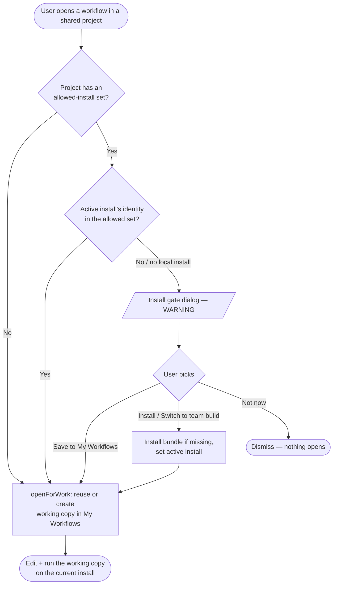
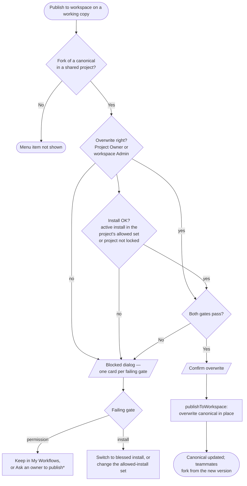
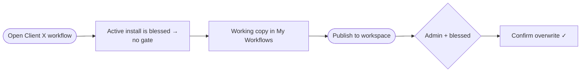
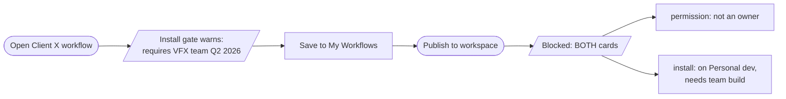
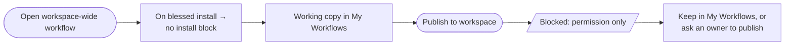
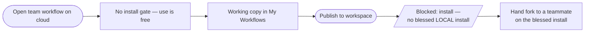

# Flow 05 — Install gate, fork-on-open, publish to workspace

How a user goes from **opening a team workflow** to **contributing a change back**, across install state and permission. This is the spine that ties together the install switcher, the install lock, fork-on-open, and Publish to workspace.

## Actors

| Persona                      | Active install             | Overwrite right on team project | Net position                                           |
| ---------------------------- | -------------------------- | ------------------------------- | ------------------------------------------------------ |
| **Install Governor** (Sasha) | VFX team Q2 2026 (blessed) | Yes (workspace Admin)           | Can do everything incl. publish                        |
| **Managed Artist** (Jonah)   | team build (blessed)       | No (Member/Runner)              | Works on a copy; can't publish                         |
| **Freelancer** (Reza)        | Personal dev (non-blessed) | No (project Collaborator)       | Blocked on both install + permission                   |
| **Workspace Member** (Alex)  | varies                     | No (Runner)                     | Permission-blocked at publish                          |
| **Cloud-only artist**        | none (cloud BE)            | No                              | Works on a copy; can never publish to a locked project |

## Wiki entries implemented

- `decisions/published-workflow-model.md` — fork-on-open, publish-to-overwrite
- `decisions/team-locked-install.md` — install lock gates publish, not use
- `decisions/workspace-install-registry.md` — where blessed installs + canonical names come from
- `concepts/install-journeys.md` — Journeys 1, 4, 5, 6
- `concepts/install-switcher.md` — active install, switch
- `prototype/design-decisions.md` — 2026-05-19 (identity gate), 2026-05-27 (publish-not-use; desktop-only)

## Source

- `src/prototype/components/WorkflowCard.vue` — open / fork-on-open / gate mount
- `src/prototype/components/InstallGateDialog.vue` — the warning gate
- `src/prototype/components/PublishToWorkspaceDialog.vue` — the publish gate
- `src/prototype/composables/useWorkflowCompat.ts` — open-time install check
- `src/prototype/composables/useWorkflowPublish.ts` — publish-time permission + install check
- `src/prototype/stores/personaStore.ts` — `openForWork`, `forkWorkflow`, `publishToWorkspace`

---

## A. Opening a team workflow (fork-on-open + install gate)

Every open of a **shared-project** workflow produces a working copy in My Workflows. The install lock only changes what the user sees _before_ the copy is made.

Key points:

- **Use is never blocked.** The gate is a warning; "Save to My Workflows" always lets the user proceed on whatever install they have.
- **Reuse.** `openForWork` returns an existing working copy if one already exists for this user + canonical, so repeated opens don't spawn duplicates.
- **A workflow already in My Workflows** opens in place (no fork) — fork-on-open is only for shared-project canonicals.

---

## B. Publishing a working copy back (publish gate)

Contribution back to the team is always **Publish to workspace** (overwrite the canonical in place — no merge). Two independent gates compose; if both fail, **both** reasons are shown.

`*` "Ask an owner to publish" is a stub — `member-overwrite-request-flow` is an open question, not MVP.

Publish-time install gate applies to **everyone, including Owners/Admins** — there is no permission-based escape hatch from the install requirement.

---

## C. Per-persona walkthroughs

### Install Governor (Sasha) — happy path

### Freelancer (Reza) — blocked on both

### Workspace Member (Alex) — permission-blocked only

### Cloud-only artist — works, never publishes to a locked project

The lock is a **desktop / local-install** mechanism by design: reproducibility means "produced on the blessed local bundle," and the cloud BE is always-latest, so it can never be a publish source for a locked project. (See `decisions/team-locked-install.md`.)

---

## Fixture state required

- A **locked project** (`proj-client-x`) with `allowedInstallIds: ['install-vfx-team-q2-2026']` + `installLockDisplayName`.
- A **workspace registry** entry for that install (canonical name + version) so the gate dialogs render the workspace-canonical name.
- Personas with differing active installs: Sasha (blessed + admin), Reza (non-blessed + Collaborator), Jonah (blessed + Member).
- A working copy is produced at runtime by opening a shared workflow (no seed needed); a seeded fork would make the publish-gate matrix one-click demoable (see Flow gaps).

## Edge cases / open threads

- **Owner opens own canonical** still forks-on-open (faithful to the wiki: every actor forks). Could be relaxed so owners edit in place — flagged, not decided.
- **Ask-an-owner hand-off** is a stub (`member-overwrite-request-flow`, not MVP). The Member and cloud-only contribution stories therefore don't _complete_ in the prototype.
- **Publish overwrite is low-visibility** — only a toast + a bumped `updatedAt`. A "last published by/at" on the canonical would make it legible.
- **No fork indicator** on the working copy's card beyond the open-toast — a "fork of X" badge + inline Publish button would surface the loop.
