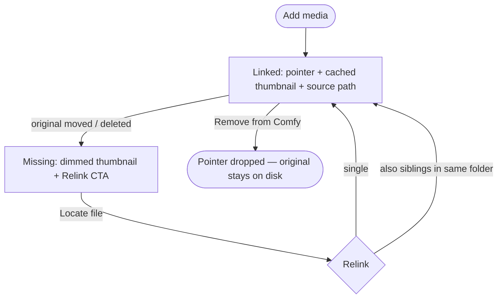

# Flow 06 — Local media as managed references (Tier 1)

**Status: NON-FINAL exploration — pending product + engineering approval.** How a local user brings their own media into Comfy as _managed references_ (After Effects / Lightroom linked-footage model): Comfy stores a pointer to the original file in place and never copies the bytes. Move the original and the link breaks → relink.

This is Tier 1 of a larger model (see the roadmap at the bottom). It proves the load-bearing loop: **add → linked → missing → relink → remove ≠ delete**.

## Actor

| Persona                            | Why                                                              | Surface                                                                                                            |
| ---------------------------------- | ---------------------------------------------------------------- | ------------------------------------------------------------------------------------------------------------------ |
| **Solo Creator — local-only (1b)** | Only local users bring local media; they have no cloud projects. | Sidebar → **Media assets** → prototype `LibraryView` (re-routed away from the upstream cloud board in local mode). |

## Wiki entries implemented

- `open-questions.md#local-media-as-references` — the working stance (always reference, unified library, lazy materialize, relink, remove ≠ delete).
- `prototype-log.md` — Flow 03 (the exploration narrative).
- `concepts/local-dashboard-views.md` — widens Media Assets beyond `output/`.
- `decisions/cloud-only-permissions.md` — referenced pointers have no permission surface.
- `decisions/asset-bundling-on-share-is-mandatory.md` + `concepts/cloud-local-bridge.md` — materialization at the cloud boundary (Tier 2).

## Source

Renders inside the **real upstream media browser** (forked) for perfect styling parity — see the 2026-06-10 "Pivot" entry in `prototype/design-decisions.md`.

- `src/prototype/components/LocalMediaView.vue` — fork of upstream `MediaAssetsView`; reuses `AssetMasonryGrid` / `MediaAssetCard` / `AssetsSidebar` / `useMediaAssetsBrowserState`. Adds the Add / link-status / missing-banner toolbar + relink/add/remove dialog hosting.
- `src/prototype/pages/Dashboard.vue` — renders `LocalMediaView` for the local persona's Media tab (cloud personas get stock `MediaAssetsView`).
- `src/prototype/composables/usePrototypeAssetsProvider.ts` — serves the store's referenced media (as `AssetItem`, link state in `user_metadata`) for the local persona.
- `src/prototype/components/{RelinkDialog,AddMediaDialog,RemoveFromComfyDialog}.vue` — the dialogs (unchanged from Tier-1).
- `src/prototype/stores/mediaReferenceStore.ts` — mutable working copy + relink/add/remove/dev-simulate actions (+ unit tests).
- `src/prototype/fixtures/localMedia.ts` — seed (12 files across 3 folders incl. a nested subfolder; `previewUrl` = bundled image as cached thumbnail).
- `src/prototype/types.ts` — `LibraryAsset` gains `origin` / `sourcePath` / `contentHash` / `linkState` / `previewUrl`; `projectId` optional.
- **Prototype-gated upstream edits** (keyed on `user_metadata`): `MediaAssetCard.vue` (missing/relink overlay + path badge), `MediaAssetContextMenu.vue` (Relink + Remove from Comfy items).

## States & loop

- **Add** (`AddMediaDialog`) — toolbar button → simulated picker; copy emphasises _links in place, no copy_.
- **Linked** — `MediaAssetCard` shows a hover hard-drive + source-path badge.
- **Missing** — cached thumbnail persists (dimmed) with a "Relink" overlay. Triggered in-demo via the DEV toolbar "Simulate folder moved".
- **Relink** (`RelinkDialog`) — click a missing card (or context-menu "Relink"); "Locate file…" fills a deterministic recovered path; when siblings in the same folder are also missing, offers a one-shot batch relink.
- **Remove** (`RemoveFromComfyDialog`) — context-menu "Remove from Comfy" → confirm; drops the pointer only, original untouched.
- **Filter** — toolbar Link-status (All / Linked / Missing) under the upstream filter-chips bar; the missing banner jumps to the Missing filter.

## Fixture state required

`solo-local` persona. `libraryAssets` seeded from `buildLocalMediaReferences()` — all `origin: 'referenced'`, `storage: 'local'`, `linkState: 'linked'`. No projects (local has none).

## Out of scope (later tiers)

- **Tier 2** — lazy materialization at the cloud boundary (reuse `useSimulatedSaveToCloud`); reference-as-workflow-input + missing-input-blocks-run.
- **Tier 3** — multi-install present/missing per-card state (also the open sub-question on path resolution across installs).
